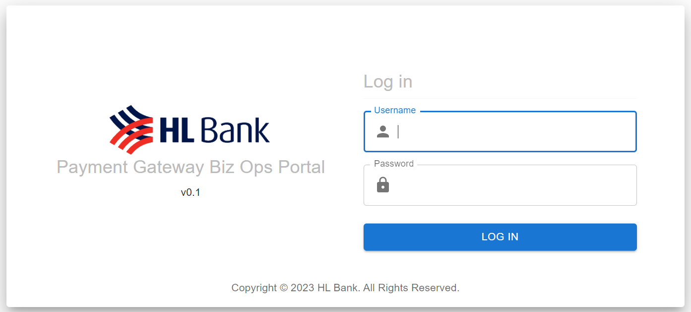
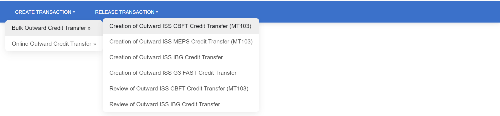
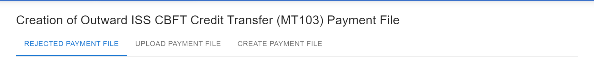
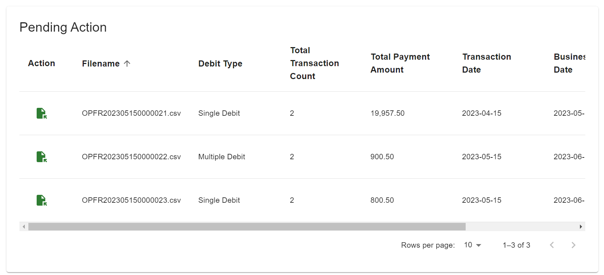
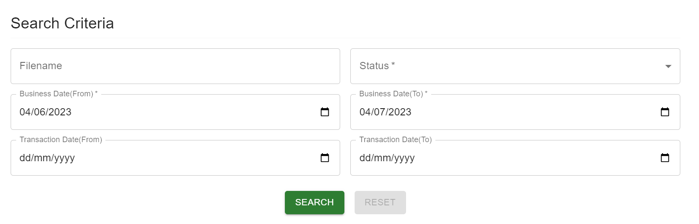
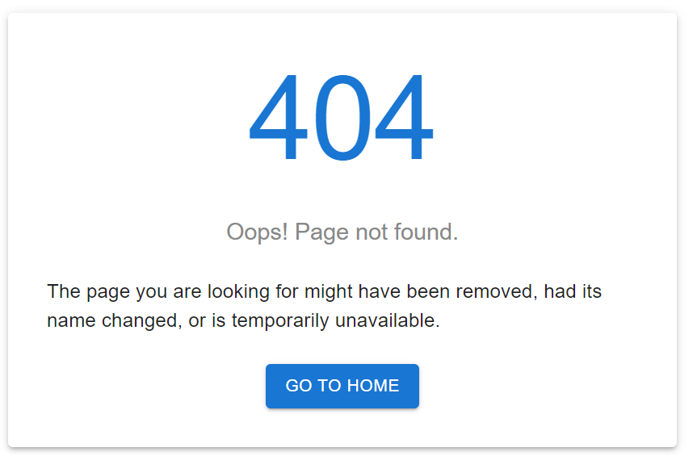
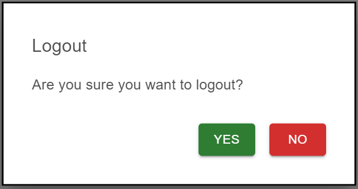
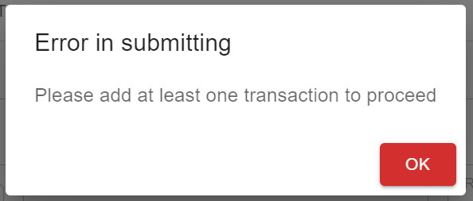

# Interfaces of component props

This page covers the props type and an example of the component usage.

[Login](../src/pages/Login.jsx)

```ts
interface LoginProps {
  imageSrc: string;
  imageAlt: string;
  centerText: string;
  version: string;
  footerText: string;
  formHeaderText: string;
  formFieldLabels: string[];
}
```

E.g:



```js
const props = {
    imageSrc: '/images/logo.png',
    imageAlt: 'hlb',
    centerText: 'Payment Gateway Biz Ops Portal',
    version: 'v0.1',
    footerText: `Copyright © ${new Date().getFullYear()} HL Bank. All Rights Reserved.`,
    formHeaderText: 'Log in',
    formFieldLabels: ['Username', 'Password']
}

<Login {...props} />
```

[UserNavBar](../src/components/navigation/UserNavBar.jsx)

```ts
interface UserNavBarProps {
  imageSrc: string;
  imageAlt: string;
  centerText: string;
  username: string;
  logoutText: string;
}
```

E.g:


```js
const props = {
    imageSrc: '/images/logo.png',
    imageAlt: 'hlb',
    centerText: 'Payment Gateway Biz Ops Portal',
    username: 'phbmaker',
    logoutText: 'Logout'
}

<UserNavBar {...props} />
```

[ModuleNavBar](../src/components/navigation/ModuleNavBar.jsx)

```ts
interface ModuleNavBarMenu {
  name: string;
  items: ModuleNavBarMenuItem[] | ModuleNavBarMenu[];
}

interface ModuleNavBarMenuItem {
  name: string;
  link: string;
}
```

E.g:



```js
 const props = [
  {
    name: 'Create Transaction',
    items: [
      {
        name: 'Bulk Outward Credit Transfer',
        items: [
          {
            name: 'Creation of Outward ISS CBFT Credit Transfer (MT103)',
            link: '/outward-iss-cbft-credit-transfer'
          },
          {
            name: 'Creation of Outward ISS MEPS Credit Transfer (MT103)',
            link: '/outward-iss-meps-credit-transfer'
          },
          {
            name: 'Creation of Outward ISS IBG Credit Transfer',
            link: '/outward-iss-ibg-credit-transfer'
          },
          {
            name: 'Creation of Outward ISS G3 FAST Credit Transfer',
            link: '/outward-iss-g3-fast-credit-transfer'
          },
          {
            name: 'Review of Outward ISS CBFT Credit Transfer (MT103)',
            link: '/review-outward-iss-cbft-credit-transfer'
          },
          {
            name: 'Review of Outward ISS IBG Credit Transfer',
            link: '/review-outward-iss-ibg-credit-transfer'
          }
        ]
      },
      {
        name: 'Online Outward Credit Transfer',
        items: [
          {
            name: 'Creation of Outward ISS CBFT Credit Transfer (MT103)',
            link: '/outward-iss-cbft-credit-transfer'
          },
          {
            name: 'Creation of Outward ISS MEPS Credit Transfer (MT103)',
            link: '/outward-iss-meps-credit-transfer'
          },
          {
            name: 'Creation of Outward Intra-Bank Credit Transfer',
            link: '/outward-intra-bank-credit-transfer'
          },
          {
            name: 'Creation of Outward ISS G3 FAST Credit Transfer',
            link: '/outward-iss-g3-fast-credit-transfer'
          },
          {
            name: 'Review of Outward ISS CBFT Credit Transfer (MT103)',
            link: '/review-outward-iss-cbft-credit-transfer'
          },
          {
            name: 'Review of Outward ISS MEPS Credit Transfer (MT103)',
            link: '/review-outward-iss-meps-credit-transfer'
          },
          {
            name: 'Review of Outward ISS G3 FAST Credit Transfer',
            link: '/review-outward-iss-g3-fast-credit-transfer'
          },
          {
            name: 'Review of Outward Intra-Bank Credit Transfer',
            link: '/review-outward-intra-bank-credit-transfer'
          }
        ]
      }
    ]
  },
  {
    name: 'Release Transaction',
    items: [
      {
        name: 'Release/Reject On-Hold Transaction Request',
        link: '/release-reject-on-hold-transaction-request'
      },
      {
        name: 'Resubmit/Reject Funding Failed Transaction Request',
        link: '/resubmit-reject-funding-failed-transaction-request'
      },
      {
        name: 'Review of Release/Reject On-Hold Transaction Request',
        link: '/review-release-reject-on-hold-transaction-request'
      },
      {
        name: 'Review of Resubmit/Reject Funding Failed Transaction Request',
        link: '/review-resubmit-reject-funding-failed-transaction-request'
      }
    ]
  }
]

<ModuleNavBar menu={props} />
```

[Footer](../src/components/Footer.jsx)

```ts
interface FooterProps {
  isFixed: boolean; // Fixed footer at bottom of screen if true
  bankName?: string; // Default value: 'HL Bank'
}
```

E.g:


```js
const props = {
    isFixed: true,
    bankName: 'HL Bank',
}

<Footer {...props} />
```

[PageTabs](../src/components/PageTabs.jsx)

```ts
interface PaymentFileTabsProps {
  title: string;
  label: string;
  content: React.ReactNode;
}
```

E.g:



```js
const props = [
    {
      title: 'Rejection of Outward ISS CBFT Credit Transfer (MT103) Payment File',
      label: 'Rejected Payment File',
      content: <RejectedPaymentMain />
    },
    {
      title: 'Upload of Outward ISS CBFT Credit Transfer (MT103) Payment File',
      label: 'Upload Payment File',
      content: <UploadPaymentMain />
    },
    {
      title: 'Creation of Outward ISS CBFT Credit Transfer (MT103) Payment File',
      label: 'Create Payment File',
      content: <CreatePaymentMain />
    }
  ];

 <PageTabs tabsContent={props} />
```

[Datatable](../src/components/datatable/index.jsx)

```ts
interface Column {
  id: string;
  label: string;
  minWidth: number;
  sortable: boolean;
  format?: (value: number) => string;
}

interface DatatableProps {
  title: string;
  columns: Column[];
  rows: Object[];
  showPagination?: boolean;
  emptyTableMessage?: string;
}
```

E.g:



```js
const columnsProp = [
  { id: 'action', label: 'Action', minWidth: 100, sortable: false },
  { id: 'filename', label: 'Filename', minWidth: 170, sortable: true },
  {
    id: 'debitType',
    label: 'Debit Type',
    minWidth: 170,
    sortable: true
  },
  {
    id: 'transactionCount',
    label: 'Total Transaction Count',
    minWidth: 120,
    sortable: true
  },
  {
    id: 'totalPaymentAmount',
    label: 'Total Payment Amount',
    minWidth: 170,
    sortable: true,
    format: (value) => formatToCurrency(value)
  },
  {
    id: 'transactionDate',
    label: 'Transaction Date',
    minWidth: 170,
    sortable: true,
    format: (value) => value.toLocaleString('en-US')
  },
  {
    id: 'businessDate',
    label: 'Business Date',
    minWidth: 170,
    sortable: true,
    format: (value) => value.toLocaleString('en-US')
  },
  {
    id: 'status',
    label: 'File Status',
    minWidth: 170,
    sortable: true
  }
];

const rowsProp = [
  {
    action: (
      <ToolTipWrapper title={viewFileToolTipText}>
        <ActionButton onClick={() => console.log('row 0 clicked')}>
          <FileOpenIcon />
        </ActionButton>
      </ToolTipWrapper>
    ),
    filename: 'OPFR202305150000021.csv',
    debitType: 'Single Debit',
    transactionCount: 2,
    totalPaymentAmount: 19957.5,
    transactionDate: '2023-04-15',
    businessDate: '2023-05-15',
    status: 'REJECTED'
  },
  {
    action: (
      <ToolTipWrapper title={viewFileToolTipText}>
        <ActionButton onClick={() => console.log('row 1 clicked')}>
          <FileOpenIcon />
        </ActionButton>
      </ToolTipWrapper>
    ),
    filename: 'OPFR202305150000022.csv',
    debitType: 'Multiple Debit',
    transactionCount: 2,
    totalPaymentAmount: 900.5,
    transactionDate: '2023-05-15',
    businessDate: '2023-06-15',
    status: 'FAILED'
  },
  {
    action: (
      <ToolTipWrapper title={viewFileToolTipText}>
        <ActionButton onClick={() => console.log('row 2 clicked')}>
          <FileOpenIcon />
        </ActionButton>
      </ToolTipWrapper>
    ),
    filename: 'OPFR202305150000023.csv',
    debitType: 'Single Debit',
    transactionCount: 2,
    totalPaymentAmount: 800.5,
    transactionDate: '2023-05-15',
    businessDate: '2023-06-15',
    status: 'PENDING'
  }
];

<DataTable title="Pending Action" columns={columnsProp} rows={rowsProp} />
```

[FormBuilder](../src/components/forms_ui/FormBuilder.jsx)

```ts
interface FormAttribute {
  type: 'text' | 'select' | 'select-autocomplete' | 'date' | 'label'
  defaultValue: string;
  componentProps: {
    name: string;
    label: string;
    'data-testid': string;
    options?: Option[];
    required?: boolean;
    disabled?: boolean;
  };
  validateDateComparison?: {
    other: string;
    func: (values: string[], schema: any) => any;
  };
}

interface Section {
  title: {
    value: string;
    variant: string;
  };
  rows: {
    fields: FormAttribute[];
  }[];
}

interface Button {
  label: string;
  isReset?: boolean;
  isLoading?: boolean;
  type: 'button' | 'reset' | 'submit' | 'loading';
  label: string;
  componentProps: {
    color: 'inherit' | 'primary' | 'secondary' | 'success' | 'error';
    onClick: () => void;
  }
}

interface Option {
  value: string;
  label: string;
}

interface FormAttributes {
  sections: Section[];
  buttons: Button[];
}

interface FormBuilderProps {
  formAttributes: FormAttributes;
  onSubmit: () => void;
  id?: number;
  formikRef?: React.MutableRefObject;
}
```

E.g:



```js
const currentDate = new Date().toJSON().slice(0, 10);
const previousMonthDate = new Date(
  new Date().setMonth(new Date().getMonth() - 1)
)
const formAttributesProp = {
    sections: [
      {
        title: {
          value: 'Search Criteria',
          variant: 'h4'
        },
        rows: [
          {
            fields: [
              {
                type: 'text',
                defaultValue: '',
                componentProps: {
                  name: 'filename',
                  label: 'Filename',
                  'data-testid': 'filename'
                }
              },
              {
                type: 'select',
                defaultValue: '',
                componentProps: {
                  required: true,
                  name: 'status',
                  label: 'Status',
                  'data-testid': 'status',
                  options: {
                    all: 'ALL',
                    rejected: 'REJECTED',
                    failed: 'FAILED',
                    declined: 'DECLINED',
                    pending: 'PENDING REVIEW'
                  }
                }
              }
            ]
          },
          {
            fields: [
              {
                type: 'date',
                defaultValue: previousMonthDate,
                componentProps: {
                  required: true,
                  name: 'businessDateFrom',
                  label: 'Business Date(From)',
                  'data-testid': 'businessDateFrom'
                }
              },
              {
                type: 'date',
                defaultValue: currentDate,
                componentProps: {
                  required: true,
                  name: 'businessDateTo',
                  label: 'Business Date(To)',
                  'data-testid': 'businessDateTo'
                },
                validateDateComparison: {
                  other: 'businessDateFrom',
                  func: ([businessDateFrom], schema) => {
                    return businessDateFrom
                      ? schema.min(
                          businessDateFrom,
                          'Business Date(To) must be later than Business Date(From)'
                        )
                      : schema;
                  }
                }
              }
            ]
          },
          {
            fields: [
              {
                type: 'date',
                defaultValue: '',
                componentProps: {
                  name: 'transactionDateFrom',
                  label: 'Transaction Date(From)',
                  'data-testid': 'transactionDateFrom'
                }
              },
              {
                type: 'date',
                defaultValue: '',
                componentProps: {
                  name: 'transactionDateTo',
                  label: 'Transaction Date(To)',
                  'data-testid': 'transactionDateTo'
                },
                validateDateComparison: {
                  other: 'transactionDateFrom',
                  func: ([transactionDateFrom], schema) => {
                    return transactionDateFrom
                      ? schema.min(
                          transactionDateFrom,
                          'Transaction Date(To) must be later than Transaction Date(From)'
                        )
                      : schema;
                  }
                }
              }
            ]
          }
        ]
      }
    ],
    buttons: [
      {
        label: 'Search',
        componentProps: {
          color: 'success'
        }
      },
      {
        label: 'Reset',
        isReset: true
      }
    ],
  };

const props = {formAttributesProp, onSubmit: () => console.log('submitting')}

<FormBuilder {...props} />
```

[NotFound](../src/pages/NotFound.jsx)

```ts
interface NotFoundProps {
  centerText: string;
  subText: string;
  buttonText: string;
  buttonLink: string;
}
```

E.g:



```js
const props = {
  centerText: 'Oops! Page not found.',
  subText: 'The page you are looking for might have been removed, had its name changed, or is temporarily unavailable.',
  buttonText: 'Go to Home',
  buttonLink: '/'
}

<NotFound {...props} />
```

[ModalBox](../src/components/ModalBox.jsx)

```ts
interface Button {
  label: string;
  type: 'button' | 'reset' | 'submit' | 'loading';
  label: string;
  componentProps: {
    color: 'inherit' | 'primary' | 'secondary' | 'success' | 'error';
    onClick: () => void;
  }
}
interface ModalBoxProps {
  isOpen: boolean;
  handleClose: () => void;
  title: string;
  description: string;
  buttons: Button[];
}
```

E.g:



```js
const [isModalOpen, setIsModalOpen] = React.useState(false);
const props = {
  isOpen: false,
  handleClose: () => setIsModalOpen(false)
  title: 'Logout',
  description: 'Are you sure you want to logout?',
  buttons: [
    {
      type: 'button',
      label: 'Yes',
      componentProps: {
        color: 'success',
        onClick: () => void
      }
    },
    {
      type: 'button',
      label: 'No',
      componentProps: {
        color: 'error',
        onClick: () => setIsModalOpen(false)
      }
    }
  ]
};

<ModalBox {...props} />
```

[AlertDialog](../src/components/AlertDialog.jsx)

```ts
interface Button {
  label: string;
  type: 'button' | 'reset' | 'submit' | 'loading';
  label: string;
  componentProps: {
    color: 'inherit' | 'primary' | 'secondary' | 'success' | 'error';
    onClick: () => void;
  }
}
interface AlertDialogProps {
  isOpen: boolean;
  handleClose: () => void;
  title: string;
  description: string;
  buttons: Button[];
}
```

E.g:



```js
const [openAlert, setOpenAlert] = useState(false)
const props = {
  open: openAlert,
  handleClose: () => setOpenAlert(false)
  title: 'Error in submitting',
  content: 'Please add at least one transaction to proceed',
  buttons: [
    {
      type: 'button',
      label: 'Ok',
      componentProps: {
        color: 'error',
        onClick: () => setOpenAlert(false)
      }
    }
  ]
};

<AlertDialog {...props} />
```
